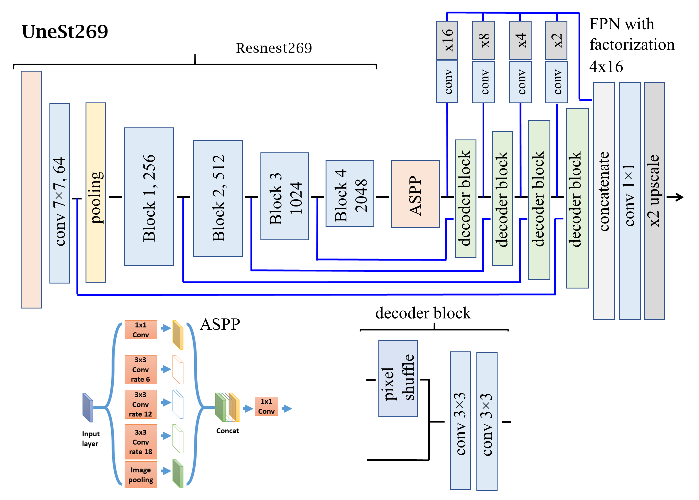

# Unest269-semantic-segmentation
Semantic segmentation with Unest269(Unet+Resnest269)

 
[Segmentation.pdf](./Project2-Segmentation.pdf)
 

My work
---------------------------------------------------------------------
- Replace backbone(ResneXt50 -> ResneSt269)
- Use multi scale dataset and ensemble

Result
---------------------------------------------------------------------

Reference
---------------------------------------------------------------------
- https://www.kaggle.com/competitions/hubmap-organ-segmentation
- https://www.kaggle.com/code/thedevastator/training-fastai-baseline
- https://www.kaggle.com/code/thedevastator/inference-fastai-baseline
